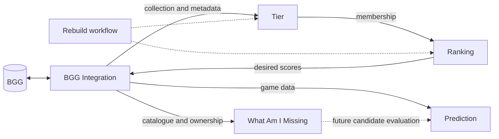

# System Map

## Agreed system boundaries

A system is a self-contained capability with a clear purpose. Pipeline stages,
agent skills and storage directories are not additional systems.

| System | Purpose and ownership | Location |
| --- | --- | --- |
| BGG Integration System | Pull (fetch and reconcile), game data provision, collection observations, authentication and publishing to BGG | `systems/bgg-integration/` |
| Tier System | Tier definitions, membership, rating intake and operator tier changes | `systems/tiers/` |
| Ranking System | Within-tier order, PubMeeple imports, decimal conversion and ranking reports | `systems/ranking/` |
| Prediction System | Advisory enjoyment estimates, model evaluation and club nominations | `systems/prediction/` |
| What Am I Missing System | Discover overlooked games and expansions; currently implements missing expansions | `systems/what-am-i-missing/` |

## Pull and Rebuild

- **Pull belongs to BGG Integration.** `systems/bgg-integration/pull/run.ps1`
  fetches a snapshot and reconciles it. It does not invoke Tier or Ranking.
- **Rebuild is a cross-system concern.** `workflows/Rebuild-BoardGames.ps1` composes
  system-owned operations. It does not fetch or publish to BGG.
- `workflows/Refresh-BoardGames.ps1` is the convenience workflow: Pull, then Rebuild.
- Publishing is explicitly invoked through BGG Integration's push operation.
- Prediction and discovery have input-specific operations; the default Rebuild
  does not fetch club sheets, retrain models or discover new candidates.

The arrows express responsibilities, not a claim that all interfaces have been
extracted. Designer discovery and its connection to Prediction remain proposed.

## Current implementation and compatibility

Implementations live under the five system directories. Existing `.agents`
script paths and `Login-Bgg.ps1` forward to their owners; `.claude` commands are
operator adapters. `architecture/entrypoints.json` records these routes.

**Intentional command change:** the old pull entrypoint now means Pull only.
Call `workflows/Refresh-BoardGames.ps1` for the previous fetch-plus-rebuild operation.
Parameter names on existing entrypoints remain available. Pull's result contains
fetch/reconcile details; Refresh returns `Pull` and `Rebuild` results separately.

Rebuild preserves rank/report -> tier map -> normalize -> tier moves -> rebalance.
Its top report now reads the local owned collection instead of making another
BGG query. Reports produced before rebalance describe that earlier state; this
migration does not yet make every report a final-state projection.
Generated PubMeeple inputs from Rebuild go to `data/publish/pubmeeple/in/` so
Rebuild does not overwrite inputs stored under immutable `data/raw/`.

## Architecture direction and remaining work

This change establishes system ownership in the repository and separates Pull
from Rebuild. It is not a completed hexagonal refactor.

1. Extract pure rules from IO-heavy scripts behind system-owned input/output
   contracts. Keep HTTP, MCP, JSON, CSV and sheet parsing in adapters.
2. Separate observed BGG ratings, operator decisions, calculated scores and
   synchronized state. Rebalance currently writes canonical data and replaces
   the pending queue; BGG Integration should own synchronization state.
3. Split the transitional `systems/ranking/support/BggTierHelpers.ps1`: it still
   combines tier definitions, identity handling, conversion and JSON helpers.
4. Make designer metadata a BGG Integration provider capability. Its cache
   acquisition is still embedded in Prediction's nomination scorer.
5. Resolve automatic fallback order versus operator-accepted order, and the
   older stackrank calculator versus the tier calculator. Preserve operator
   judgments when changing these contracts.
6. Make reports explicit about observed or calculated state. Resolve the
   remaining legacy cache locations under `data/raw/` without rewriting snapshots.
7. Reconcile prediction uncertainty guidance and validate the provisional model
   before adopting a house recommendation algorithm.

These are recommendations for subsequent work, not implemented behavior or
authorization to change scoring rules. The acceptance checks for this migration
are command routing, relocated dependencies, preserved contracts on existing
entrypoints, local-only Rebuild and isolated system regression checks.

## Supporting concerns

- `scripts/`: checkpointing, status and repository checks.
- `data/`: existing persisted data and reports; no data migration in this change.
- `tools/bgg-mcp/`: vendored provider implementation, not a sixth system.
- `.local/`: ignored secrets and temporary local material.
- System READMEs document ownership; CONTRACTS.md files identify current data
  contracts. Detailed persisted schemas remain in `.agents/context/contracts.md`.

## Design references

- [Screaming Architecture](https://blog.cleancoder.com/uncle-bob/2011/09/30/Screaming-Architecture.html): organize around application purpose.
- [Hexagonal Architecture](https://alistair.cockburn.us/hexagonal-architecture): separate application behavior from external adapters.
