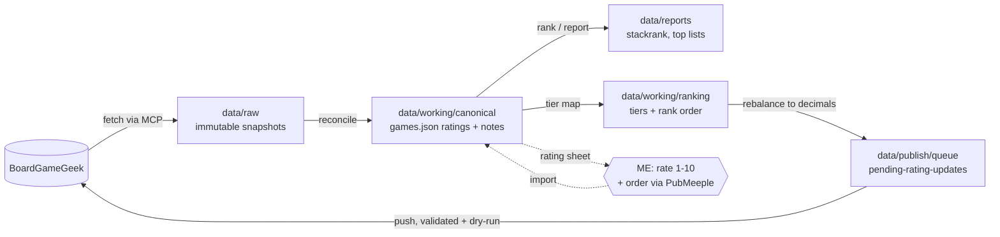

# Board Games — BGG Collection Pipeline

Personal pipeline for managing the [BoardGameGeek](https://boardgamegeek.com) collection of
`MrHinsh`: pull plays and collection data into a local canonical dataset, rate and tier-rank
games, and push the resulting ratings back to BGG.

**Core principle:** ratings (1–10) and game ordering are *human judgment only* — they come
from me playing the games, entered directly or via pairwise-comparison tools (PubMeeple).
The machinery's job is faithful transport, bookkeeping, and conversion math. Agents and
scripts never propose, infer, or reorder ratings
(guardrail: [.agents/guardrails/global-rules.md](.agents/guardrails/global-rules.md)).

The repo is operated by AI agents (start at [AGENTS.md](AGENTS.md)) or by hand. Implementations live under `systems/`; agent skills are compatibility entrypoints.

## How it works



Pull belongs to BGG Integration; Rebuild is a cross-system workflow. See the [system map](.agents/context/system-map.md).

```powershell
# PULL - fetch from BGG and reconcile (BGG Integration only)
./.agents/skills/mrhinsh-bg-pull/scripts/run.ps1 -Username 'MrHinsh' -ApiKey $env:BGG_API_KEY

# REBUILD - local cross-system workflow
./workflows/Rebuild-BoardGames.ps1

# REFRESH - convenience: Pull then Rebuild
./workflows/Refresh-BoardGames.ps1 -Username MrHinsh -ApiKey $env:BGG_API_KEY

# PUSH - write side: sync the pending rating queue to BGG (always dry-run first)
./.agents/skills/mrhinsh-bg-push/scripts/run.ps1 -Username 'MrHinsh' -WhatIf
./.agents/skills/mrhinsh-bg-push/scripts/run.ps1 -Username 'MrHinsh'
```

Pull requires the MCP server running at `http://localhost:8080/mcp`
(`./.agents/skills/mrhinsh-bg-pull-fetch/scripts/Start-BggMcpServer.ps1`).

Between pull and push sit the two **human loops** (step-by-step sequences in the
[ops runbook](.agents/context/ops-runbook.md)):

1. **Rating intake** — rebuild generates `data/publish/sheets/bgg-rating-upload-sheet.csv`
   with context columns (plays, year, players, complexity, community rating); I fill
   `new_rating` (1–10) and optional `notes`, then import it back into canonical.
2. **Tier and order** — ratings map to tiers (S=10, A=9, B=8, C=7, D=6, F=1–5, U=unrated,
   X=exit collection); within-tier order comes from me, optionally via PubMeeple pairwise
   ranking round-trips; rebalance converts my order into decimal BGG ratings and fills the
   push queue. Formula: [.agents/context/rating-system.md](.agents/context/rating-system.md).

## Status at a glance

```powershell
./scripts/Get-BgStatus.ps1
```

Compact JSON: collection counts, unrated games (and which have plays — my rating-session
candidates), push-queue size, large rating jumps flagged for review, snapshot freshness.
In Claude Code, `/mrhinsh-bg-status` runs this and narrates it.

## One-time setup

1. **Build the MCP server** (Go required; source is vendored, see
   [tools/bgg-mcp/VENDORED.md](tools/bgg-mcp/VENDORED.md)):

   ```powershell
   cd tools/bgg-mcp
   go build -o bgg-mcp.exe .
   ```

2. **Enable the pre-commit smoke check** (once per clone):

   ```powershell
   git config core.hooksPath .githooks
   ```

3. **Authenticate to BGG** (cookie cache in gitignored `.local/`):

   ```powershell
   ./Login-Bgg.ps1
   ```

   If Cloudflare blocks scripted login (HTTP 403), import a browser cookie:

   ```powershell
   $cookie = Read-Host "Paste full Cookie header"
   ./Login-Bgg.ps1 -Username MrHinsh -Cookie $cookie -PersistScope User -Force
   ```

## Claude Code commands

| Slash command | What it does |
| --- | --- |
| `/mrhinsh-bg-status` | Brief me on pipeline state — counts, queue, anomalies, freshness |
| `/mrhinsh-bg-pull` | Fetch BGG data and reconcile; use Refresh for a full rebuild |
| `/mrhinsh-bg-push` | Sync pending ratings to BGG (dry-run first) |
| `/mrhinsh-bg-import-ratings` | Apply my edited rating sheet to canonical data |
| `/mrhinsh-bg-audit` | Check live BGG collection for duplicate copies with diverged ratings |
| `/mrhinsh-bg-push-rating` | Set one game's rating on BGG directly |
| `/mrhinsh-bg-push-play` | Log a single play to BGG |

These are thin shims in `.claude/skills/` over the scripts — same behavior as running the
scripts by hand.

## Safety nets

- **Checkpoints**: every script that mutates canonical data (reconcile, imports, rebalance)
  first snapshots `games.json`, `equivalent-games.json`, and `intake-ranked.json` to
  `data/state/checkpoints/<timestamp>-<reason>/` (last 20 kept, local only). Recovery steps
  are in the [ops runbook](.agents/context/ops-runbook.md).
- **Push validation**: the queue sync refuses ratings outside 1–10, X/U-tier entries, and
  rating jumps larger than 2 points (override deliberately with `-AllowLargeDelta`).
  `-WhatIf` dry-runs are supported everywhere writes happen.
- **Pre-commit hook**: `./scripts/Test-Repo.ps1` runs on every commit — parses all scripts,
  validates `games.json` against the [data contracts](.agents/context/contracts.md)
  (required fields, duplicate ids, negative plays), and verifies skill shims point at real
  scripts.
- **Git as backup**: canonical data is tracked; commit after every import/rebalance so any
  bad mutation is one `git restore` away.
- **Immutable snapshots**: raw BGG fetches under `data/raw/` are timestamped and never
  overwritten.

## Where things live

| Path | Contents |
| --- | --- |
| `systems/` | The five systems: implementation, documentation, contracts and tests |
| `workflows/` | Cross-system Rebuild and Refresh composition |
| `.agents/skills/` | Operator instructions and compatibility entrypoints |
| `.agents/context/` | Runbook, data contracts, rating/tier specs, system map |
| `.agents/guardrails/` | Non-negotiable agent policy (secrets, data flow, judgment integrity) |
| `.claude/skills/` | Claude Code slash-command shims |
| `.githooks/` | Tracked git hooks (pre-commit smoke check) |
| `scripts/` | Repo-level utilities: `Test-Repo`, `Get-BgStatus`, `Checkpoint-Canonical` |
| `data/raw/` | Immutable BGG snapshots + PubMeeple in/out files |
| `data/working/` | Canonical dataset and intermediates — **`canonical/games.json` is the crown jewel** |
| `data/reports/` | Generated ranking/top/quality reports |
| `data/publish/` | Upload sheets, tier exports, pending-update queues |
| `data/state/checkpoints/` | Pre-mutation safety copies (gitignored) |
| `tools/bgg-mcp/` | Vendored BGG MCP server (Go), local patch documented |
| `.local/` | Secrets and cookie cache — gitignored, never commit |

## Documentation map

| Question | Doc |
| --- | --- |
| How do agents operate here? | [AGENTS.md](AGENTS.md) |
| How do I run each workflow, step by step? | [.agents/context/ops-runbook.md](.agents/context/ops-runbook.md) |
| What shape is each data file? | [.agents/context/contracts.md](.agents/context/contracts.md) |
| How do tiers/ranks convert to ratings? | [.agents/context/rating-system.md](.agents/context/rating-system.md), [tier-ranking-formula.md](.agents/context/tier-ranking-formula.md) |
| What are the hard rules? | [.agents/guardrails/](/.agents/guardrails/) |
| Architecture overview | [.agents/context/system-map.md](.agents/context/system-map.md) |
| What does skill X do? | `.agents/skills/<name>/SKILL.md` |
